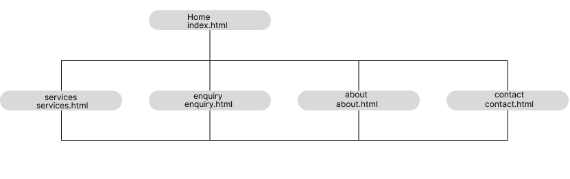

# M&P Customs — Website Project (WEDE5020)

## Student Information
- **Name:** Mohamed Zaeem Motala
- **Student Number:** ST10515004
- **Module:** WEDE5020 — Web Development (Introduction)
- **Campus:** IIE Emeris Sandton
- **Lecturer:** Jessel Sookha

## Project Overview
M&P Customs is a metal fabrication and 3D printing business that makes advanced manufacturing accessible to anyone, with or without experience. This company specialises in 3D printing in metal and plastic, CNC machining, welding, and CAD designing services.

## Website Goals and Objectives
1. Make users aware of our services.
2. Encourage users to fill out the contact or enquiry form.

## Key Features and Functionality
1. This site contains 5 pages: Home, About, Enquiry, Contact, and Services.
2. Each page has a navigation menu that excludes the current page you are on, and each page has a "back to top" function.

## Timeline and Milestones
- Week 1–2: Proposal approved, planning of HTML structure
- Week 3–6: CSS styling and responsive design
- Week 7–10: JavaScript functionality
- Week 11–12: Testing, refining, and final submission

## Part 1 Details

### Content Research and Sourcing
- **Text Content:** Written specifically for M&P Customs based on the approved proposal, covering all 5 pages.
- **Images:** Sourced from Pexels (free stock photos) for workshop, welding, 3D printing, and CNC-related visuals.
- **Icons:** Sourced from SVGRepo with appropriate CC0, CC Attribution, and PD licenses.
- **Team Member Names:** Generated using a South African name generator for realistic fictional team members.

### Website Structure and Planning
The website was planned using a sitemap created in Figma to understand site hierarchy and how the navigation would be handled.

### Sitemap


Figma link: https://www.figma.com/design/IAVM6PVkYBK4r712gqPqUC/Untitled?node-id=2-42&t=T79HgJ503JorCNSK-1

### File and Folder Structure
```
root/
├── index.html
├── about.html
├── services.html
├── enquiry.html
├── contact.html
├── styles/
│   └── styles.css
├── js/
│   └── script.js
└── images/
    ├── 3D-Printing-1.jpg
    ├── 3D-Printing-2.jpg
    ├── CAD2.jpg
    ├── cad.jpg
    ├── CNC1.jpg
    ├── CNC2.jpg
    ├── welding.jpg
    ├── welding2.jpg
    └── svg/
        ├── instagram-svgrepo-com.svg
        ├── phone-svgrepo-com.svg
        ├── mail-alt-svgrepo-com.svg
        ├── tools-svgrepo-com.svg
        └── profile-round-1342-svgrepo-com.svg
```

### HTML Structure and Basic Content
Home (index.html)
├── About (about.html)
├── Services (services.html)
├── Enquiry (enquiry.html)
└── Contact (contact.html)

## Changelog

| Date | Change | Section |
|------|--------|---------|
| 23 Aug 2026 | First commit | Repository setup |
| 23 Aug 2026 | Added images and pages folders | File/Folder Structure |
| 23 Aug 2026 | Small changes to page naming scheme | File/Folder Structure |
| 23 Aug 2026 | Added java and css folders | File/Folder Structure |
| 23 Aug 2026 | Updated README with project details and structure rough draft | Documentation |
| 25 Aug 2026 | Removed `pages` folder following brief; renamed root folder to a web-safe handle; renamed `java` folder to `js` | File/Folder Structure |
| 25 Aug 2026 | Merged remote repository history with local project | Repository setup |
| 26 Aug 2026 | Added code for contact, index, and enquiry pages | HTML Structure |
| 26 Aug 2026 | Added bones (semantic structure) to all pages; started adding wording to main page | HTML Structure |
| 26 Aug 2026 | Finished index page and started about page | HTML Structure |
| 26 Aug 2026 | Added content to about page; slight modifications to other pages | HTML Structure / Content |
| 27 Aug 2026 | About page finished; started enquiry page | HTML Structure |
| 28 Aug 2026 | Finished contact page | HTML Structure |
| 30 Aug 2026 | Finished services page (gallery, service descriptions, alt text added); updated README with Project Overview, Goals, Features, Timeline, File/Folder Structure, and Sitemap content | HTML Structure / Documentation |
| 30 Aug 2026 | Final push Readme complete and comments added final test tomorrow 31 AUG 2026 |

## References

### Images

Pexels, n.d. Photo of a man welding. [Photograph]. Available at: https://www.pexels.com/photo/photo-of-a-man-welding-27102112/ [Accessed: 18 August 2026].

Pexels, n.d. Welding-related photograph. [Photograph]. Available at: https://www.pexels.com/search/welding/ [Accessed: 25 August 2026].

Pexels, n.d. 3D printing-related photograph. [Photograph]. Available at: https://www.pexels.com/search/3d%20printing/ [Accessed: 25 August 2026].

Pexels, n.d. CAD-related photograph. [Photograph]. Available at: https://www.pexels.com/search/cad/ [Accessed: 25 August 2026].

Pexels, n.d. CNC-related photograph. [Photograph]. Available at: https://www.pexels.com/search/cnc/ [Accessed: 25 August 2026].

*(Note: several images were sourced via mobile share links that returned Pexels category search pages rather than individual photo permalinks. These are cited at the category level per the disclaimer below. Original image set sourced 18 August 2026; additional images sourced 25 August 2026.)*

### Icons (SVG)

SVG Repo, n.d. Tools. [SVG icon]. CC0 License. Available at: https://www.svgrepo.com/svg/476487/tools [Accessed: 18 August 2026].

Filatov, K., n.d. Instagram. [SVG icon]. Gentlecons Interface Icons collection. CC Attribution License. Available at: https://www.svgrepo.com/svg/521711/instagram [Accessed: 18 August 2026].

Dazzle UI, n.d. Phone. [SVG icon]. Dazzle Line Icons collection. CC Attribution License. Available at: https://www.svgrepo.com/svg/533285/phone [Accessed: 18 August 2026].

Dazzle UI, n.d. Mail Alt. [SVG icon]. Dazzle Line Icons collection. CC Attribution License. Available at: https://www.svgrepo.com/svg/533194/mail-alt [Accessed: 18 August 2026].

bypeople, n.d. Profile Round 1342. [SVG icon]. Minimal UI Icons collection. PD License. Available at: https://www.svgrepo.com/svg/512729/profile-round-1342 [Accessed: 18 August 2026].

### Tools & Resources

NamesNerd, n.d. South African Name Generator. [Online tool]. Available at: https://www.namesnerd.com/people/south-african-name-generator/ — used to generate fictional team member names for the About Us page.

Phone Number Extractor, n.d. Number Generator. [Online tool]. Available at: https://phonenumberextractor.com/numbergenerator/extractionresult.aspx — used to generate a fictional South African contact number for the Contact page.

Google My Maps, n.d. [Online tool]. Available at: https://www.google.com/maps/d/u/0/edit?mid=1pia3fwbkqTUZsUVl3d2pEByEDmAcc-8 — used to create the embedded map on the Contact page.

W3Schools, n.d. [Online resource]. Available at: https://www.w3schools.com/ — reference resource for HTML syntax, semantic elements, and general web development guidance throughout the build.

### Referencing & Institutional Sources

The Independent Institute of Education (IIE), 2026. Harvard-Anglia style reference guide — adapted for The IIE. [pdf] The Independent Institute of Education. Available at: [IIE internal resource] [Accessed: date].

The Independent Institute of Education (IIE), 2026. Guidelines for responsible AI use at The IIE (PDIIE023). [pdf] The Independent Institute of Education. Available at: [IIE internal resource] [Accessed: date].

Anthropic, 2026. Claude (claude-sonnet-4-6). [Large language model]. Available at: [https://claude.ai/share/4b129e95-cd00-4497-86d3-9ca3cd2af4b1] [Accessed: date].

⚠️ **Disclaimer:** All references above must be verified by the student before submission. Claude may make errors in referencing. It is the student's responsibility to ensure all references are accurate and comply with the IIE Harvard-Anglia Style Guide (2026).

## AI Interaction Disclosure
*(per PDIIE023 — see also annexure in Website Project Proposal document)*

---

## AI Interaction Rules — Claude

1. **Hints Only — No Doing the Work.** Claude may only assist through hints, guidance, and feedback. Claude must never complete assignment questions, write pseudocode, draw flowcharts, or produce any academic content on the student's behalf, under any circumstance.
2. **Attempt First Policy.** The student must always attempt every task first before Claude provides assistance. If the student has genuinely attempted a task more than once and is still stuck, Claude may provide a more detailed hint.
3. **Document Summaries.** Claude is permitted to summarise uploaded documents or study material to help the student understand the content.
4. **Helpful Links.** Claude may provide links to relevant websites or resources that support the student's learning.
5. **Formatting & Presentation.** The student may ask Claude to format and present completed work. Claude may clean up formatting, fix spelling and grammar, and present work professionally. Claude must never add new content, change answers, or alter any logic. All academic content remains the student's own. Claude must remind the student to disclose AI formatting use in their "Disclosure of AI Usage in my Assessment" annexure per PDIIE023.
6. **Claude Reference — Every Document.** Every completed document must include a correctly formatted Harvard-Anglia IIE reference to Claude, including the chat link from that specific conversation.
7. **Referencing Disclaimer.** Whenever Claude assists with or produces a reference, a disclaimer must be included noting that all references must be verified by the student before submission.
8. **Permanent Reference List.** Every completed document must include references to the IIE Harvard-Anglia style guide and the PDIIE023 guidelines.
9. **Rules Appendix.** When completing any document, Claude must include these rules in full at the end of the document as an appendix titled "AI Interaction Rules — Claude."